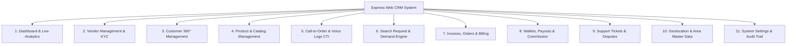

# Express Hyperlocal Marketplace & Call-to-Order CRM System
## Complete System Requirements Specification (SRS) & Architecture Documentation

---

## 1. Executive Summary & Project Overview

### 1.1 Background & Purpose
The **Express CRM** is a centralized web application and administrative portal designed to manage, monitor, and scale the **Express Hyperlocal Marketplace & Call-to-Order Platform**. 

The existing mobile application connects local retail vendors (Electronics, Grocery, Medicine, Hardware, Clothing, etc.) with local customers through geolocation-based discovery, real-time voice call order placement, localized search demand broadcast, and instant invoice generation.

The CRM website serves as the **operational backbone** for:
1. **Super Admins & Business Owners**: High-level business analytics, revenue/commission tracking, system configuration, vendor approvals, and audit logs.
2. **Regional / Area Managers**: Overseeing specific geographic zones (Division -> District -> Upazila -> Area/Bazar level operations).
3. **CRM / Support Operators**: Handling customer support tickets, unfulfilled search requests, call-to-order assistance, and disputes.
4. **Vendors / Merchants (Merchant Portal)**: Web-based shop dashboard for inventory management, invoice tracking, customer call history, and order processing.

---

## 2. User Roles & Access Control (RBAC)

| Role | Description | Core Permissions |
| :--- | :--- | :--- |
| **Super Admin** | Full platform control and system owner | User & Vendor management, commission setup, payout approvals, global analytics, system configuration, role delegation. |
| **Area Manager** | Regional operations supervisor | Area vendor approval, local inventory monitoring, localized customer demand tracking, local issue resolution. |
| **CRM / Support Agent** | Customer & merchant support operator | Ticket management, call log reviews, search request dispatching, manual invoice correction, dispute resolution. |
| **Finance Manager** | Accounts and settlements officer | Invoice audit, vendor payout processing, refund approvals, ledger reconciliation, tax & commission reports. |
| **Vendor / Merchant** | Business owner portal | Product catalog CRUD, price updates, incoming search request replies, order & invoice history, earnings & payout requests. |

---

## 3. Core Functional Modules Breakdown



---

### Module 1: Dashboard & Live Analytics
- **Live Platform Overview**:
  - Total Gross Merchandise Value (GMV), daily/weekly/monthly revenue.
  - Total active vendors, registered customers, completed orders, and active calls.
- **Geographic Heatmap**:
  - Order density and search demand categorized by Division, District, and Upazila.
- **Demand Intelligence Feed**:
  - Live stream of unfulfilled customer search queries in real time.
- **Top Metrics**:
  - Top performing vendors by volume and rating.
  - Top searched categories and high-demand products.

---

### Module 2: Vendor / Merchant Management
- **Vendor Directory**:
  - Filterable by Status (Active, Pending KYC, Suspended, Inactive), Category, Division, District, Upazila, and Bazar/Area.
- **Vendor Onboarding & KYC**:
  - Shop name, owner name, NID / Trade License verification, phone verification, shop location coordinates (Lat/Lng), physical address.
- **Merchant Details View (Vendor 360°)**:
  - Shop profile, active product list, total invoices generated, total earnings, commission rate (%), call logs, customer ratings/reviews.
- **Vendor Actions**:
  - Approve/Reject KYC, adjust commission rate, suspend/ban account, reset credentials, assign Area Manager.

---

### Module 3: Customer Management (Customer 360°)
- **Customer Directory**:
  - List of registered customers with phone number, name, registered area, lifetime spending, order count.
- **Customer Profile 360°**:
  - Order history and invoices.
  - Call history with local merchants.
  - Submitted product search requests and conversion rates.
  - Support ticket history and complaints.
- **Customer Actions**:
  - Block/Unblock user, send direct notification/SMS, view audit logs.

---

### Module 4: Centralized Product & Catalog Management
- **Universal Product Catalog & Category Taxonomy**:
  - Categories: Electronics, Grocery, Medicine, Hardware, Clothing, Others (expandable).
  - Sub-categories, brand tags, units of measurement (pcs, kg, bag, strip, box, etc.).
- **Vendor Inventory Oversight**:
  - Search any product across all vendors by area, SKU, barcode, or name.
  - Monitor stock levels, price variations across different vendors, and out-of-stock items.
- **Batch Management**:
  - Bulk CSV/Excel product import/export for vendors.

---

### Module 5: Call Center & Active Call-to-Order (CTI)
- **Call Session Logging**:
  - Log of all voice calls initiated through the app (Caller ID, Receiver ID, Call Duration, Call Timestamp, Status: Completed / Missed / Busy).
- **In-Call Cart & Conversion Tracking**:
  - Tracking which calls resulted in an instant generated invoice (`INV-xxxxx`).
  - Order conversion rate analysis per vendor and per category.
- **Operator Assistance**:
  - Ability for CRM operators to manually initiate a call to customer/vendor to resolve stalled orders.

---

### Module 6: Search Request & Demand Intelligence Engine
- **Unfulfilled Search Capture**:
  - When a customer searches for an item with 0 local matches, the CRM records the query, area, and timestamp.
- **Vendor Broadcast Dispatch**:
  - Automatically or manually notify local vendors in that specific Upazila/Area: *"Customer in Kaliganj is looking for 'Samsung 45W Adapter'"*.
- **Demand Analytics**:
  - Identify missing product inventory in specific areas to recruit new vendors or suggest stock restocking to existing merchants.

---

### Module 7: Invoices, Orders & Billing Management
- **Centralized Invoices Table**:
  - Fields: Invoice ID (e.g. `INV-10001`), Customer Details, Vendor Details, Area, Items List, Subtotal, Discount, Platform Fee/Commission, Total, Payment Method (Cash on Delivery / Digital), Status (Pending, Completed, Cancelled, Refunded).
- **Invoice Actions**:
  - View full itemized invoice details.
  - Generate & download PDF invoice.
  - Cancel/Refund with audit trail.
  - Resend invoice SMS/Push notification to customer.

---

### Module 8: Wallets, Payouts & Commission Engine
- **Commission Management**:
  - Global commission rule vs. category-specific or vendor-specific rates (e.g., 2% on Electronics, 1.5% on Grocery).
- **Vendor Earnings Ledger**:
  - Breakdown of gross sales, platform commission deducted, net payable to vendor.
- **Payout Request Processing**:
  - Vendors submit withdrawal requests (bKash, Nagad, Bank Transfer).
  - Finance team approves/rejects with transaction reference ID.

---

### Module 9: Support Ticket & Dispute Resolution
- **Ticket Lifecycle Management**:
  - Statuses: `Open`, `Assigned`, `In Progress`, `Waiting on Customer/Vendor`, `Resolved`, `Closed`.
  - Priority levels: `Low`, `Medium`, `High`, `Urgent`.
- **Ticket Categorization**:
  - Wrong item delivered, overcharging, fake product, vendor unavailable, app technical bug.
- **Internal Notes & Communication**:
  - CRM operators can add internal staff-only notes and reply directly to users.

---

### Module 10: Geolocation & Area Master Data Management
- **Hierarchical Location Structure**:
  - **Division** (e.g. Dhaka, Chittagong, Rajshahi, Sylhet)
  - **District** (e.g. Dhaka, Gazipur, Narayanganj)
  - **Upazila** (e.g. Kaliganj, Sreepur, Gazipur Sadar)
  - **Area / Village / Bazar** (e.g. Kaliganj Bazar, Tumulia, Nagari, Jangal)
- **Zone Master Tools**:
  - Add/Edit/Disable areas and bazars.
  - Assign Area Managers to specific Upazilas.
  - Set GPS coordinates / Geo-fence radii for precise nearby discovery.

---

### Module 11: System Settings, RBAC & Audit Trail
- **Role & Permission Matrix**: Create custom roles with granular permissions.
- **Audit Logs**: Immutable log of every admin action (who changed what, timestamp, IP address).
- **Notification & SMS Gateway Configuration**: Setup SMS API (e.g., Twilio, SSL Wireless, Greenweb) and Push Notification keys (Firebase FCM).

---

## 4. Technical Architecture & Tech Stack

```
+---------------------------------------------------------------+
|                    FRONTEND (Web CRM)                         |
|  - Next.js 14 / React 18+ (TypeScript)                        |
|  - UI: Tailwind CSS + Shadcn UI / Radix UI                    |
|  - State: Zustand / TanStack Query (React Query)              |
|  - Charts: Recharts / Chart.js                                |
|  - Realtime: Socket.io Client / Pusher JS                     |
+---------------------------------------------------------------+
                               |
                       (HTTPS / WSS / REST)
                               |
+---------------------------------------------------------------+
|                    BACKEND API LAYER                          |
|  - Node.js (NestJS / Express) OR Laravel 11                   |
|  - Authentication: JWT / OAuth2 + RBAC Middleware             |
|  - Realtime Engine: Socket.io / Pusher (Events & Pings)       |
|  - PDF Generation: Puppeteer / PDFKit                         |
|  - Task Queue: BullMQ / Redis Queue (SMS, Emails, Broadcasts) |
+---------------------------------------------------------------+
                               |
        +----------------------+----------------------+
        |                                             |
+-------------------+                         +-----------------+
| DATABASE LAYER    |                         | CACHE & QUEUE   |
| PostgreSQL / MySQL|                         | Redis           |
| (Prisma/Eloquent) |                         | (Sessions/Lock) |
+-------------------+                         +-----------------+
        |
+---------------------------------------------------------------+
| THIRD-PARTY SERVICES                                          |
| - Cloud Storage: AWS S3 / Cloudflare R2 (PDFs, KYC Docs)      |
| - SMS Gateway: Twilio / Local BD Gateway (bKash/Nagad Webhook)|
| - Push Notifications: Firebase Cloud Messaging (FCM)          |
| - VoIP / Voice Engine: Agora / WebRTC Signaling               |
+---------------------------------------------------------------+
```

---

## 5. Database Schema Design (PostgreSQL / Relational)

```sql
-- 1. Users & RBAC
CREATE TYPE user_role_enum AS ENUM ('super_admin', 'area_manager', 'crm_operator', 'finance', 'vendor', 'customer');
CREATE TYPE user_status_enum AS ENUM ('active', 'suspended', 'pending_approval', 'inactive');

CREATE TABLE users (
    id BIGSERIAL PRIMARY KEY,
    name VARCHAR(150) NOT NULL,
    phone VARCHAR(20) UNIQUE NOT NULL,
    email VARCHAR(150) UNIQUE,
    password_hash VARCHAR(255) NOT NULL,
    role user_role_enum NOT NULL DEFAULT 'customer',
    status user_status_enum NOT NULL DEFAULT 'active',
    avatar_url TEXT,
    created_at TIMESTAMP WITH TIME ZONE DEFAULT NOW(),
    updated_at TIMESTAMP WITH TIME ZONE DEFAULT NOW()
);

-- 2. Geographic Hierarchy
CREATE TABLE divisions (
    id SERIAL PRIMARY KEY,
    name VARCHAR(100) NOT NULL UNIQUE
);

CREATE TABLE districts (
    id SERIAL PRIMARY KEY,
    division_id INT REFERENCES divisions(id) ON DELETE CASCADE,
    name VARCHAR(100) NOT NULL
);

CREATE TABLE upazilas (
    id SERIAL PRIMARY KEY,
    district_id INT REFERENCES districts(id) ON DELETE CASCADE,
    name VARCHAR(100) NOT NULL
);

CREATE TABLE areas (
    id SERIAL PRIMARY KEY,
    upazila_id INT REFERENCES upazilas(id) ON DELETE CASCADE,
    name VARCHAR(150) NOT NULL,
    postal_code VARCHAR(20),
    latitude DECIMAL(10, 8),
    longitude DECIMAL(11, 8)
);

-- 3. Vendors & Shop Profiles
CREATE TABLE vendors (
    id BIGSERIAL PRIMARY KEY,
    user_id BIGINT UNIQUE REFERENCES users(id) ON DELETE CASCADE,
    shop_name VARCHAR(200) NOT NULL,
    category VARCHAR(100) NOT NULL, -- Electronics, Grocery, Medicine, etc.
    address TEXT NOT NULL,
    division_id INT REFERENCES divisions(id),
    district_id INT REFERENCES districts(id),
    upazila_id INT REFERENCES upazilas(id),
    area_id INT REFERENCES areas(id),
    commission_rate DECIMAL(5, 2) DEFAULT 2.00, -- Percentage
    nid_number VARCHAR(50),
    trade_license VARCHAR(100),
    is_verified BOOLEAN DEFAULT FALSE,
    wallet_balance DECIMAL(12, 2) DEFAULT 0.00,
    created_at TIMESTAMP WITH TIME ZONE DEFAULT NOW()
);

-- 4. Products & Catalog
CREATE TABLE products (
    id BIGSERIAL PRIMARY KEY,
    vendor_id BIGINT REFERENCES vendors(id) ON DELETE CASCADE,
    name VARCHAR(255) NOT NULL,
    category VARCHAR(100) NOT NULL,
    description TEXT,
    price DECIMAL(10, 2) NOT NULL,
    stock INT NOT NULL DEFAULT 0,
    unit VARCHAR(50) NOT NULL DEFAULT 'pcs',
    is_available BOOLEAN DEFAULT TRUE,
    tags TEXT[], -- Array of search tags
    image_url TEXT,
    created_at TIMESTAMP WITH TIME ZONE DEFAULT NOW(),
    updated_at TIMESTAMP WITH TIME ZONE DEFAULT NOW()
);

-- 5. Invoices & Order Items
CREATE TYPE invoice_status_enum AS ENUM ('pending', 'completed', 'cancelled', 'refunded');

CREATE TABLE invoices (
    id VARCHAR(50) PRIMARY KEY, -- e.g. INV-10001
    customer_id BIGINT REFERENCES users(id),
    customer_name VARCHAR(150),
    customer_phone VARCHAR(20),
    vendor_id BIGINT REFERENCES vendors(id),
    vendor_shop_name VARCHAR(200),
    subtotal DECIMAL(12, 2) NOT NULL,
    discount DECIMAL(12, 2) DEFAULT 0.00,
    commission_amount DECIMAL(12, 2) DEFAULT 0.00,
    total DECIMAL(12, 2) NOT NULL,
    status invoice_status_enum DEFAULT 'completed',
    payment_method VARCHAR(50) DEFAULT 'Cash on Delivery',
    created_at TIMESTAMP WITH TIME ZONE DEFAULT NOW()
);

CREATE TABLE invoice_items (
    id BIGSERIAL PRIMARY KEY,
    invoice_id VARCHAR(50) REFERENCES invoices(id) ON DELETE CASCADE,
    product_id BIGINT REFERENCES products(id),
    product_name VARCHAR(255) NOT NULL,
    price DECIMAL(10, 2) NOT NULL,
    quantity INT NOT NULL,
    line_total DECIMAL(12, 2) NOT NULL
);

-- 6. Search Requests (Demand Stream)
CREATE TABLE search_requests (
    id VARCHAR(50) PRIMARY KEY,
    query_text VARCHAR(255) NOT NULL,
    customer_id BIGINT REFERENCES users(id),
    area_name VARCHAR(150) NOT NULL,
    upazila_id INT REFERENCES upazilas(id),
    status VARCHAR(50) DEFAULT 'unfulfilled', -- unfulfilled, responded, converted
    created_at TIMESTAMP WITH TIME ZONE DEFAULT NOW()
);

-- 7. Call Logs (CTI)
CREATE TABLE call_logs (
    id VARCHAR(50) PRIMARY KEY,
    caller_id BIGINT REFERENCES users(id),
    caller_role user_role_enum NOT NULL,
    receiver_id BIGINT REFERENCES users(id),
    receiver_phone VARCHAR(20) NOT NULL,
    duration_seconds INT DEFAULT 0,
    status VARCHAR(50) NOT NULL, -- completed, missed, rejected
    invoice_id VARCHAR(50) REFERENCES invoices(id),
    created_at TIMESTAMP WITH TIME ZONE DEFAULT NOW()
);

-- 8. Support Tickets
CREATE TYPE ticket_status_enum AS ENUM ('open', 'assigned', 'in_progress', 'resolved', 'closed');
CREATE TYPE ticket_priority_enum AS ENUM ('low', 'medium', 'high', 'urgent');

CREATE TABLE support_tickets (
    id BIGSERIAL PRIMARY KEY,
    ticket_number VARCHAR(50) UNIQUE NOT NULL,
    creator_id BIGINT REFERENCES users(id),
    assigned_to_id BIGINT REFERENCES users(id),
    subject VARCHAR(255) NOT NULL,
    description TEXT NOT NULL,
    category VARCHAR(100),
    status ticket_status_enum DEFAULT 'open',
    priority ticket_priority_enum DEFAULT 'medium',
    created_at TIMESTAMP WITH TIME ZONE DEFAULT NOW(),
    updated_at TIMESTAMP WITH TIME ZONE DEFAULT NOW()
);

CREATE TABLE ticket_replies (
    id BIGSERIAL PRIMARY KEY,
    ticket_id BIGINT REFERENCES support_tickets(id) ON DELETE CASCADE,
    sender_id BIGINT REFERENCES users(id),
    is_internal_note BOOLEAN DEFAULT FALSE,
    message TEXT NOT NULL,
    created_at TIMESTAMP WITH TIME ZONE DEFAULT NOW()
);

-- 9. Payouts & Transactions
CREATE TABLE payout_requests (
    id BIGSERIAL PRIMARY KEY,
    vendor_id BIGINT REFERENCES vendors(id),
    amount DECIMAL(12, 2) NOT NULL,
    payment_method VARCHAR(50) NOT NULL, -- bKash, Nagad, Bank
    account_number VARCHAR(100) NOT NULL,
    status VARCHAR(50) DEFAULT 'pending', -- pending, approved, rejected
    processed_by BIGINT REFERENCES users(id),
    transaction_ref VARCHAR(100),
    created_at TIMESTAMP WITH TIME ZONE DEFAULT NOW(),
    processed_at TIMESTAMP WITH TIME ZONE
);
```

---

## 6. REST API Specification for Web CRM

### 6.1 Authentication & Profile
- `POST /api/crm/auth/login` - Staff & Admin login with JWT & Refresh tokens.
- `POST /api/crm/auth/logout` - Invalidate session.
- `GET /api/crm/auth/me` - Fetch authenticated user profile & permissions.
- `PUT /api/crm/auth/profile` - Update staff credentials.

### 6.2 Analytics & Reporting
- `GET /api/crm/analytics/overview` - KPI cards (GMV, orders, active vendors, unfulfilled searches).
- `GET /api/crm/analytics/sales-chart?interval=daily|weekly|monthly` - Revenue trends.
- `GET /api/crm/analytics/demand-heatmap` - Query search volume by zone/area.
- `GET /api/crm/analytics/top-vendors` - Top merchant ranking by sales & response rate.

### 6.3 Vendor Management
- `GET /api/crm/vendors` - List vendors with pagination, filters (area, category, status, search).
- `GET /api/crm/vendors/:id` - Full Vendor 360° profile.
- `POST /api/crm/vendors` - Create/Onboard vendor manually.
- `PUT /api/crm/vendors/:id` - Update vendor info, area, category, commission rate.
- `PATCH /api/crm/vendors/:id/status` - Toggle status (active/suspended/approved).
- `DELETE /api/crm/vendors/:id` - Soft delete vendor.

### 6.4 Customer Management
- `GET /api/crm/customers` - List customers with search and filters.
- `GET /api/crm/customers/:id` - Customer 360° (order history, calls, tickets).
- `PATCH /api/crm/customers/:id/status` - Block / unblock customer.

### 6.5 Orders & Invoices
- `GET /api/crm/invoices` - List all invoices with date range, vendor, customer, area filters.
- `GET /api/crm/invoices/:id` - Detailed invoice view with item list.
- `GET /api/crm/invoices/:id/pdf` - Stream/download official PDF invoice.
- `POST /api/crm/invoices/manual-create` - Operator manual invoice creation.
- `PATCH /api/crm/invoices/:id/status` - Update status (refunded/cancelled).

### 6.6 Search Requests & Demand Engine
- `GET /api/crm/search-requests` - List unfulfilled and recent search requests.
- `POST /api/crm/search-requests/:id/broadcast` - Broadcast notification to local area vendors.
- `GET /api/crm/search-requests/summary` - Aggregated missing keywords per area.

### 6.7 Calls & CTI Logs
- `GET /api/crm/calls` - List voice call logs with duration, status, conversion.
- `GET /api/crm/calls/stats` - Call volume, answer rate, conversion percentage.

### 6.8 Support Tickets
- `GET /api/crm/tickets` - List tickets with filter by status, priority, assignee.
- `POST /api/crm/tickets` - Create new ticket.
- `GET /api/crm/tickets/:id` - View ticket conversation thread.
- `POST /api/crm/tickets/:id/reply` - Send public reply or internal staff note.
- `PATCH /api/crm/tickets/:id/assign` - Assign ticket to operator.
- `PATCH /api/crm/tickets/:id/status` - Update status (resolved/closed).

### 6.9 Area & Master Data Management
- `GET /api/crm/locations/tree` - Full hierarchical tree (Division -> District -> Upazila -> Area).
- `POST /api/crm/locations/division` - Add new division.
- `POST /api/crm/locations/district` - Add new district.
- `POST /api/crm/locations/upazila` - Add new upazila.
- `POST /api/crm/locations/area` - Add new area / village / bazar.

### 6.10 Finance & Payouts
- `GET /api/crm/payouts` - List payout withdrawal requests.
- `PATCH /api/crm/payouts/:id/approve` - Approve payout with bank/bKash TrxID.
- `PATCH /api/crm/payouts/:id/reject` - Reject payout with reason note.
- `GET /api/crm/finance/ledger` - Comprehensive commission and payout ledger.

---

## 7. Web CRM UI / UX Sitemap & Screen Breakdown

```
CRM Web Portal
│
├── 🔐 Auth Pages
│   ├── Login Screen (/login)
│   ├── Forgot / Reset Password (/forgot-password)
│   └── 2FA Verification (/verify-otp)
│
├── 📊 Dashboard (/dashboard)
│   ├── Top KPI Cards (GMV, Active Calls, Open Requests, Pending KYC)
│   ├── Real-time Activity Feed & Demand Bar
│   ├── Sales Revenue Graph (Interactive filters)
│   └── Regional Area Heatmap
│
├── 🏪 Vendor Management (/vendors)
│   ├── Vendor Directory & Filter Grid
│   ├── Pending Verification Queue (/vendors/pending)
│   ├── Vendor Details 360° (/vendors/:id)
│   │   ├── Overview Tab
│   │   ├── Products & Stock Tab
│   │   ├── Invoices & Orders Tab
│   │   └── Call & Conversion History Tab
│   └── Add / Edit Vendor Modal
│
├── 👥 Customer Management (/customers)
│   ├── Customers List & Search
│   └── Customer 360° Profile (/customers/:id)
│
├── 📦 Product Catalog (/products)
│   ├── Global Product Catalog
│   ├── Out of Stock Alerts
│   └── Category & Tag Management
│
├── 🧾 Invoices & Orders (/invoices)
│   ├── All Invoices Table (Status filters)
│   ├── Invoice Detail Drawer / Modal
│   └── PDF Invoice Generator Preview
│
├── 🔎 Search Request Engine (/search-requests)
│   ├── Live Search Demand Stream
│   ├── Missing Products Aggregate View
│   └── Vendor Broadcast Dispatcher Tool
│
├── 📞 Call Center & Logs (/calls)
│   ├── Real-time Active Call Monitor
│   ├── Call History Table
│   └── Conversion Analytics
│
├── 🎫 Support Ticket Center (/tickets)
│   ├── Ticket Kanban / Table View (Open, In Progress, Resolved)
│   ├── Ticket Detail Conversation & Reply Box
│   └── Internal Notes & Escalate Action
│
├── 💳 Finance & Payouts (/finance)
│   ├── Payout Requests Queue
│   ├── Platform Commission Ledger
│   └── Payout Approval Modal (TrxID input)
│
├── 🗺️ Area & Zone Settings (/zones)
│   ├── Division / District / Upazila / Area Tree Editor
│   └── Geofence & Location Mapper
│
└── ⚙️ System Settings (/settings)
    ├── Staff Users & Role Permissions (RBAC)
    ├── Commission Rules
    ├── SMS & Push Gateway Config
    └── Audit Log Viewer
```

---

## 8. Implementation Roadmap & Phases

### Phase 1: Core Foundation & Authentication (Weeks 1 - 2)
- Set up Next.js 14 Web App + Tailwind CSS + Shadcn UI.
- Implement RBAC authentication (Super Admin, Area Manager, CRM Agent, Finance).
- Design responsive layout (Collapsible Sidebar, Header with Area Filter, Dark/Light Mode).

### Phase 2: Vendor & Customer 360° Modules (Weeks 3 - 4)
- Build Vendor Directory, KYC approval flow, and Vendor 360° profile view.
- Build Customer Directory and order history integration.
- Implement Division -> District -> Upazila -> Area hierarchical dropdowns and location filters.

### Phase 3: Invoices, Product Catalog & Search Request Engine (Weeks 5 - 6)
- Invoices listing, filtering, itemized breakdown, and PDF generation.
- Product Catalog management with stock tracking.
- Search Demand Intelligence: Live broadcast of customer unfulfilled requests to local vendors.

### Phase 4: Call Center Logs, Support Tickets & Finance (Weeks 7 - 8)
- Call log tracking and call-to-order conversion metrics.
- Multi-agent Support Ticket system with conversation threads and internal notes.
- Vendor Payout Request approval workflow and Commission Ledger.

### Phase 5: Analytics, Real-time Alerts & Polish (Weeks 9 - 10)
- Real-time WebSocket integration for new orders, calls, and urgent support tickets.
- Comprehensive charts (Revenue, Volume, Area comparisons).
- Security audits, data export (Excel/CSV), and load testing.

---

## 9. Next Steps for Development

To start developing this Web CRM website:
1. Initialize the Web CRM project in a directory (e.g. `express-crm-web` using Next.js 14+ / React).
2. Connect to the backend API database (PostgreSQL / Laravel or NestJS).
3. Build the UI components following this documentation specification.
